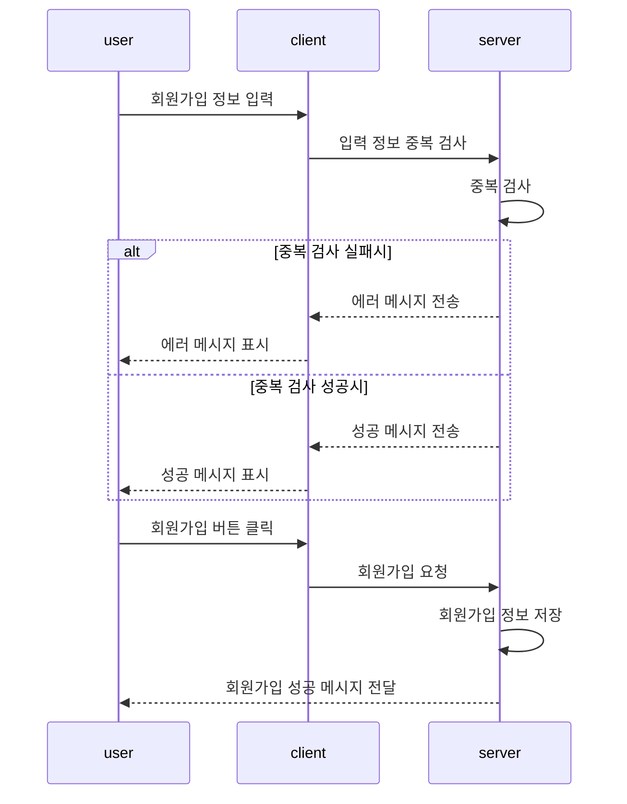
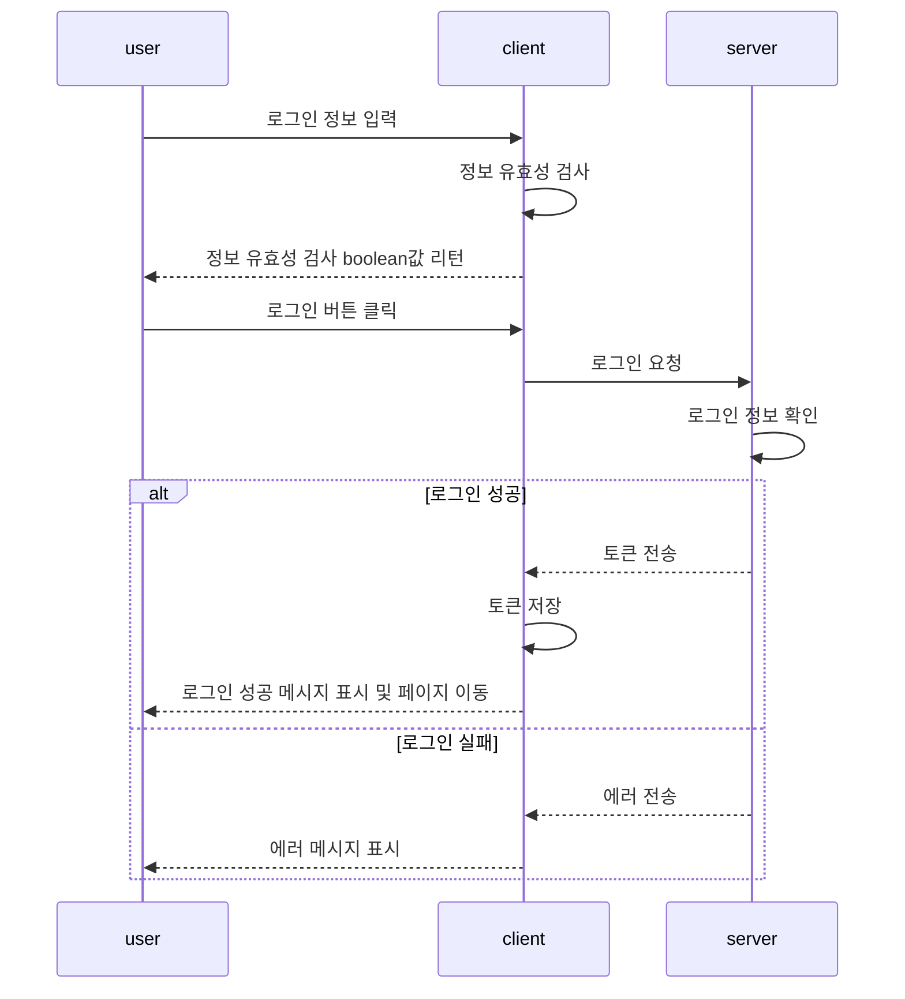
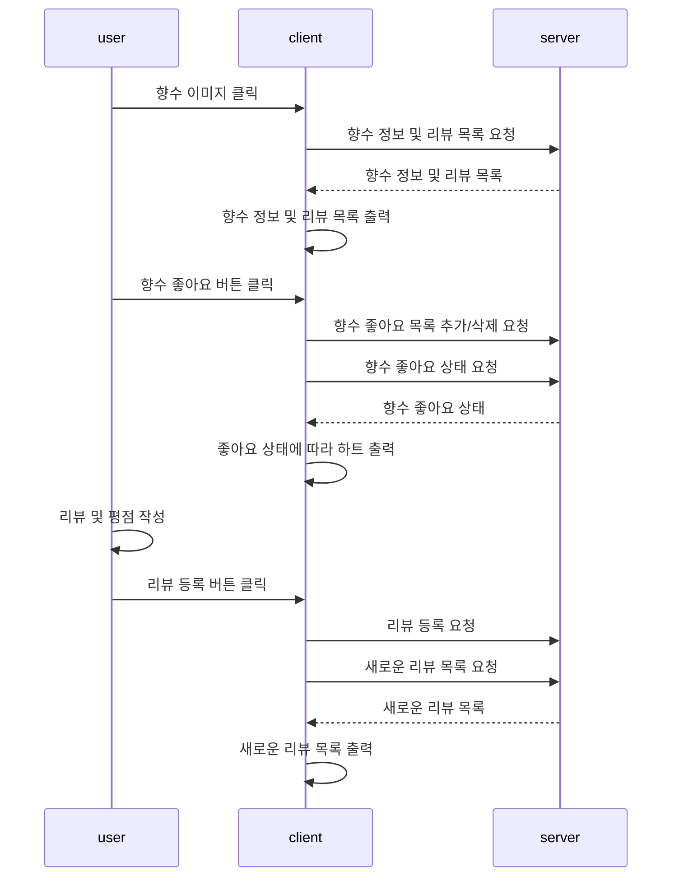
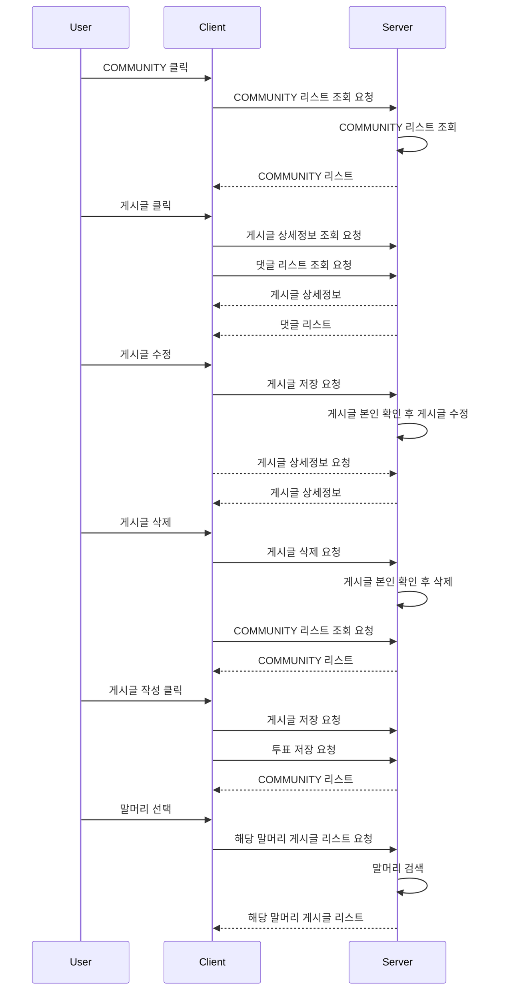
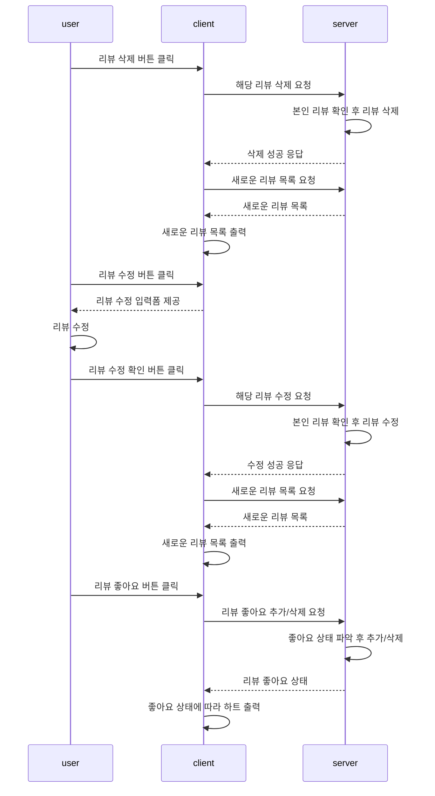
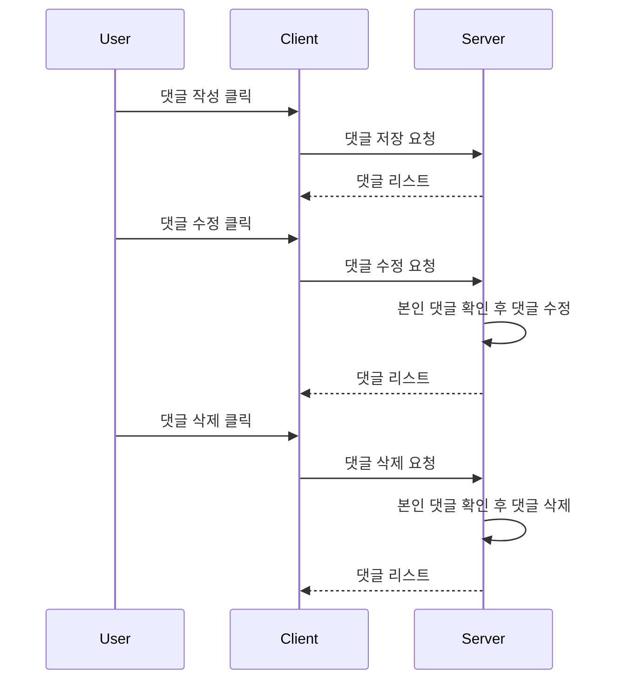

## 회원가입

```mermaid
sequenceDiagram
	user->>client: 회원가입 정보 입력
	client->>server: 입력 정보 중복 검사
	server->>server: 중복 검사
	alt 중복 검사 실패시
		server-->> client: 에러 메시지 전송
		client-->> user : 에러 메시지 표시
	else 중복 검사 성공시
		server-->> client: 성공 메시지 전송
		client-->> user : 성공 메시지 표시 
	end

	user->>client: 회원가입 버튼 클릭
	client->>server: 회원가입 요청
  server->>server: 회원가입 정보 저장
  server-->>user: 회원가입 성공 메시지 전달
```

## 로그인

```mermaid
sequenceDiagram
	user->>client: 로그인 정보 입력
	client->>client: 정보 유효성 검사
	client-->>user: 정보 유효성 검사 boolean값 리턴
	user->> client: 로그인 버튼 클릭
	client->> server: 로그인 요청
	server->>server: 로그인 정보 확인
	
	alt 로그인 성공
        server-->>client: 토큰 전송
        client->>client: 토큰 저장
        client-->>user: 로그인 성공 메시지 표시 및 페이지 이동
  else 로그인 실패
  			server-->>client: 에러 전송
  			client-->>user: 에러 메시지 표시
  end
		
```

## 향수 상세 페이지

```mermaid
sequenceDiagram
    participant user
    participant client
    participant server
   
    user->>client: 향수 이미지 클릭
    client->>server: 향수 정보 및 리뷰 목록 요청
    server-->>client: 향수 정보 및 리뷰 목록
    client->>client: 향수 정보 및 리뷰 목록 출력

    user->>client: 향수 좋아요 버튼 클릭
    client->>server: 향수 좋아요 목록 추가/삭제 요청
    client->>server: 향수 좋아요 상태 요청
    server-->>client: 향수 좋아요 상태
    client->>client: 좋아요 상태에 따라 하트 출력


    user->>user: 리뷰 및 평점 작성
    user->>client: 리뷰 등록 버튼 클릭
    client->>server: 리뷰 등록 요청
    client->>server: 새로운 리뷰 목록 요청
    server-->>client: 새로운 리뷰 목록
    client->>client: 새로운 리뷰 목록 출력
```

##  커뮤니티

```mermaid
sequenceDiagram
    participant User
    participant Client
    participant Server

   User->>Client: COMMUNITY 클릭
    Client->>Server: COMMUNITY 리스트 조회 요청
    Server->>Server : COMMUNITY 리스트 조회
    Server-->>Client: COMMUNITY 리스트
    
    User->>Client: 게시글 클릭
    Client->>Server: 게시글 상세정보 조회 요청
    Client->>Server: 댓글 리스트 조회 요청
    Server-->>Client: 게시글 상세정보
    Server-->>Client: 댓글 리스트

    User->>Client: 게시글 수정
    Client->>Server: 게시글 저장 요청
    Server->>Server : 게시글 본인 확인 후 게시글 수정
    Client-->>Server: 게시글 상세정보 요청
    Server-->>Client: 게시글 상세정보

    User->>Client: 게시글 삭제
    Client->>Server: 게시글 삭제 요청
    Server->>Server: 게시글 본인 확인 후 삭제
    Client->>Server: COMMUNITY 리스트 조회 요청
    Server-->>Client: COMMUNITY 리스트

    User->>Client: 게시글 작성 클릭
    Client->>Server: 게시글 저장 요청
    Client->>Server: 투표 저장 요청
    Server-->>Client: COMMUNITY 리스트

    User->>Client: 말머리 선택
    Client->>Server: 해당 말머리 게시글 리스트 요청
    Server->>Server : 말머리 검색
    Server-->>Client: 해당 말머리 게시글 리스트
```

## 리뷰

```mermaid
sequenceDiagram
    participant user
    participant client
    participant server

    user->>client: 리뷰 삭제 버튼 클릭
    client->>server: 해당 리뷰 삭제 요청
    server->>server: 본인 리뷰 확인 후 리뷰 삭제
    server-->>client: 삭제 성공 응답
    client->>server: 새로운 리뷰 목록 요청
    server-->>client: 새로운 리뷰 목록
    client->>client: 새로운 리뷰 목록 출력

    user->>client: 리뷰 수정 버튼 클릭
    client-->>user: 리뷰 수정 입력폼 제공
    user->>user: 리뷰 수정
    user->>client: 리뷰 수정 확인 버튼 클릭
    client->>server: 해당 리뷰 수정 요청
    server->>server: 본인 리뷰 확인 후 리뷰 수정
    server-->>client: 수정 성공 응답
    client->>server: 새로운 리뷰 목록 요청
    server-->>client: 새로운 리뷰 목록
    client->>client: 새로운 리뷰 목록 출력
    
    user->>client: 리뷰 좋아요 버튼 클릭
    client->>server: 리뷰 좋아요 추가/삭제 요청
    server->>server: 좋아요 상태 파악 후 추가/삭제
    server-->>client: 리뷰 좋아요 상태
    client->>client: 좋아요 상태에 따라 하트 출력

```

## 댓글

```mermaid
sequenceDiagram
	participant User
    participant Client
    participant Server

    User->>Client: 댓글 작성 클릭
    Client->>Server: 댓글 저장 요청
    Server-->>Client: 댓글 리스트

    User->>Client: 댓글 수정 클릭
    Client->>Server: 댓글 수정 요청
    Server->>Server: 본인 댓글 확인 후 댓글 수정
    Server-->>Client: 댓글 리스트

    User->>Client: 댓글 삭제 클릭
    Client->>Server: 댓글 삭제 요청
    Server->>Server: 본인 댓글 확인 후 댓글 삭제
    Server-->>Client: 댓글 리스트
```

